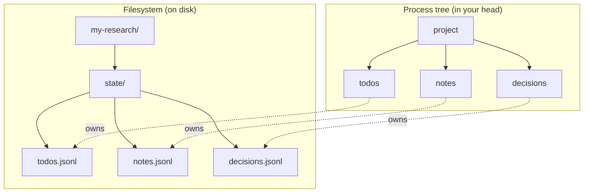
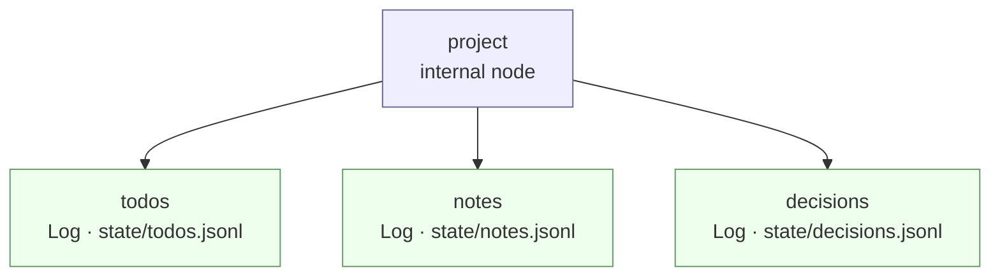
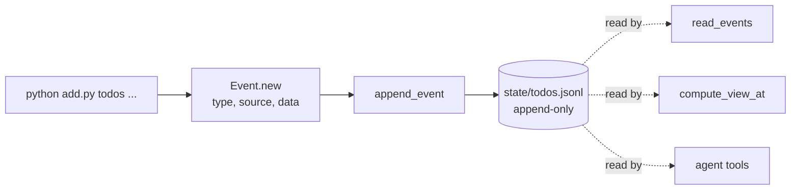
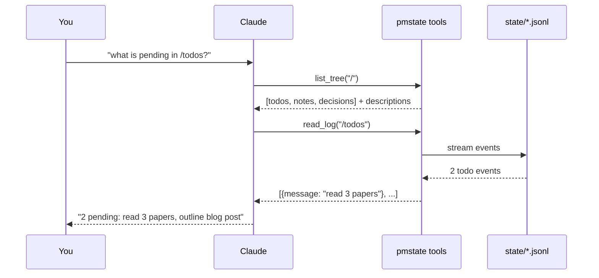
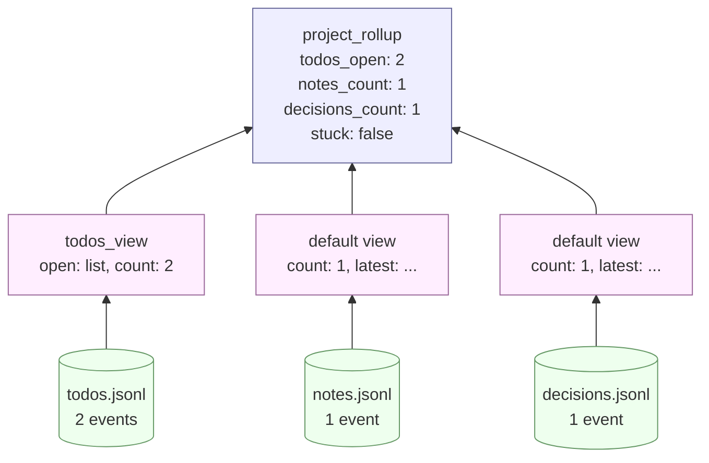
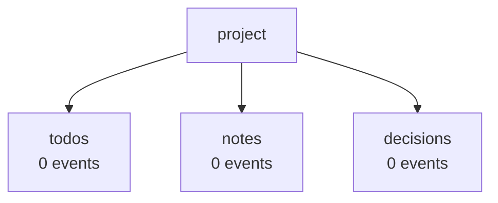
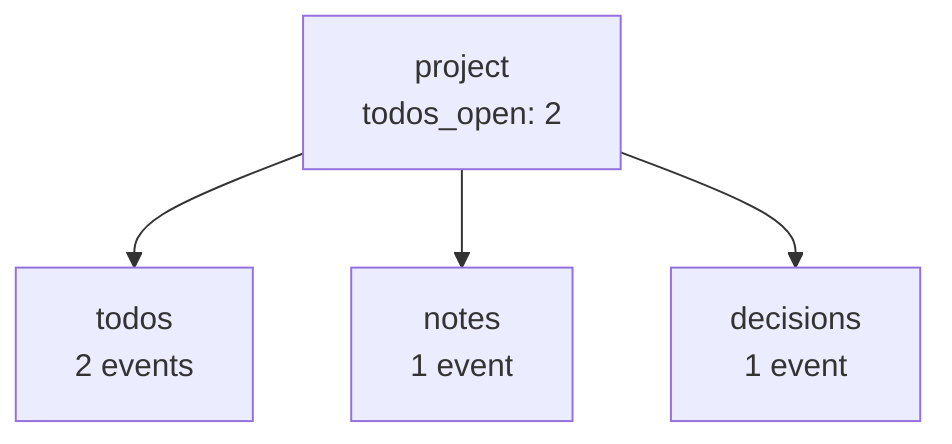
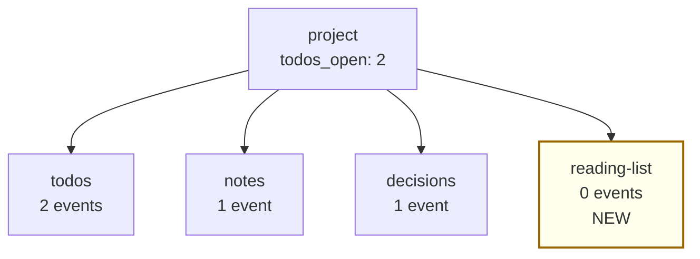

# Quickstart — build your first process tree in 10 minutes

This guide walks you through building a tiny but real process tree from
scratch: a personal **research-project tracker** with three buckets — *todos*,
*notes*, and *decisions*. By the end, you'll have an LLM agent that can answer
questions like *"what's pending?"* and *"what did I decide about X?"* by
reading your filesystem.

You'll learn the four core ideas of `pmstate`:

1. **The directory IS the state** — each piece of state lives in a real file
   on disk. No database, no schema migrations.
2. **Nodes** — named positions in your process tree, like folders.
3. **Logs** — append-only event lists (one JSON line per event).
4. **Views and reducers** — small functions that summarise raw events into
   answers an agent can read.

If you've used CrewAI or LangGraph: pmstate has **no DSL, no compile step, no
graph object**. Just plain Python values + JSON on disk + four agent tools.

## Picture it

The mental model is just two things side by side:



The agent navigates the **left side** (calling things like `list_tree("/")`
and `get_state("/todos")`); your data actually lives on the **right side**.
The `Node` you wire up in code is just a pointer that says *"this branch of
the process owns this file."*

---

## Prerequisites

You need:

- **Python 3.11 or newer.** Check with `python --version` (or `python3 --version`).
- **An Anthropic API key.** Get one at <https://console.anthropic.com/>.
  You'll set it as an environment variable below. Each run of the agent costs
  a few cents.

That's it. No accounts, no other services.

---

## The CLI flow (recommended)

`pmstate` ships a four-verb CLI: `init`, `validate`, `seed`, `run`. It
turns a single declarative `pmstate.yaml` into a working project — no
hand-written boilerplate.

### Step 1 — Install and set your API key

**macOS / Linux**

```bash
mkdir my-research && cd my-research
python3 -m venv .venv && source .venv/bin/activate
pip install "pmstate[claude-sdk]"
export ANTHROPIC_API_KEY="sk-ant-..."
```

**Windows (PowerShell)**

```powershell
mkdir my-research; cd my-research
python -m venv .venv; .venv\Scripts\Activate.ps1
pip install "pmstate[claude-sdk]"
$env:ANTHROPIC_API_KEY = "sk-ant-..."
```

### Step 2 — Author your `pmstate.yaml`

Run `pmstate init` once with no arguments. It writes a heavily commented
`pmstate.example.yaml`:

```bash
pmstate init
$EDITOR pmstate.example.yaml      # turn it into your spec
mv pmstate.example.yaml pmstate.yaml
```

For our research tracker the spec is:

```yaml
name: my-research
pmstate_version: "0.2.0"
tree:
  root: project
  nodes:
    - path: /project/work
      children:
        - {name: todos,     state: log, view: bucket_view}
        - {name: notes,     state: log, view: bucket_view}
        - {name: decisions, state: log, view: bucket_view}
events:
  todo.added:
    schema: {title: str, owner: str}
  note.added:
    schema: {topic: str, body: str}
  decision.recorded:
    schema: {about: str, choice: str}
```

If you're driving this from Claude Code (or another LLM), point it at
[`docs/spec-authoring.md`](docs/spec-authoring.md) — the full agent-facing
guide for translating natural-language requests into this YAML.

### Step 3 — Generate the project, validate, seed, run

```bash
pmstate init --from-spec pmstate.yaml .   # writes tree.py, views.py, …
pmstate validate                          # confirms everything builds
pmstate seed --n 30                       # 30 deterministic events
pmstate run "what's pending?"             # asks the tree
```

That's it. Six commands from a fresh terminal to an LLM-navigable process.
The CLI generated `tree.py`, `views.py`, `reducers.py`, `chat.py`, and
`AGENTS.md` for you. Edit them freely — they're plain Python.

For deeper customisation, keep reading: the appendix below walks through
authoring the same files **by hand**, which is also how you learn what each
piece is doing.

---

## Without the CLI (the v0.1 manual flow)

The rest of this guide builds the same tracker without the CLI. It's the
v0.1-style flow — useful for understanding what `pmstate init` is doing for
you, and for projects that need shapes the spec can't yet express.

### Step 1 — Set up a fresh project

Open a terminal and create a project folder. We'll keep everything inside it:

**macOS / Linux**

```bash
mkdir my-research && cd my-research
python3 -m venv .venv
source .venv/bin/activate
pip install "pmstate[claude-sdk]"
```

**Windows (PowerShell)**

```powershell
mkdir my-research; cd my-research
python -m venv .venv
.venv\Scripts\Activate.ps1
pip install "pmstate[claude-sdk]"
```

The `[claude-sdk]` part installs the optional Claude Agent SDK so the agent
runtime works. After this, `pip list | grep pmstate` (or `pip list | findstr
pmstate` on Windows) should show `pmstate 0.2.0` and `claude-agent-sdk`.

Set your API key for this terminal session:

**macOS / Linux**

```bash
export ANTHROPIC_API_KEY="sk-ant-..."
```

**Windows (PowerShell)**

```powershell
$env:ANTHROPIC_API_KEY = "sk-ant-..."
```

---

### Step 2 — Define the shape of your process

Create a file called `tree.py`. This file describes **what your process looks
like** — three buckets under one root, all under a tree named `research`.

```python
# tree.py
from pathlib import Path
from pmstate import Log, Node, Tree

# Where the state files live on disk.
STATE = Path(__file__).parent / "state"

def build_tree() -> Tree:
    return Tree(
        "my-research",
        root=Node(
            "project",
            description="A simple research project.",
            children=[
                Node("todos",     state=Log(STATE / "todos.jsonl"),     description="Things to do."),
                Node("notes",     state=Log(STATE / "notes.jsonl"),     description="Observations and findings."),
                Node("decisions", state=Log(STATE / "decisions.jsonl"), description="Choices I have committed to."),
            ],
        ),
    )
```

**What just happened?** You said: *my process is a tree with one root called
`project` and three children — `todos`, `notes`, `decisions`. Each child
stores its events in a `.jsonl` file under a `state/` folder.*

A `Log` is just an append-only file: every event gets one JSON line.

The `description` strings are how the agent knows what each bucket is *for* —
they show up in the agent's `list_tree` output. Treat them like one-line
folder labels.

Here's exactly what `build_tree()` returns, drawn out:



Internal nodes (blue) have children but no state of their own — their view
is computed from below. Leaf nodes (green) own a state file. There's no
limit on depth; you could nest `Node("active", children=[Node("project", ...)])`
to model multi-project setups.

---

### Step 3 — Write some events

Create `add.py`. This is a tiny CLI for appending events to your buckets:

```python
# add.py
import sys
from pmstate import Event, append_event
from tree import build_tree

def main() -> None:
    if len(sys.argv) < 3:
        print('usage: python add.py <bucket> <message>')
        print('  bucket = todos | notes | decisions')
        sys.exit(1)

    bucket, message = sys.argv[1], " ".join(sys.argv[2:])
    tree = build_tree()
    leaf = tree.get(f"/{bucket}")          # locate the bucket node
    log_path = leaf.state.path             # where its log file lives
    event = Event.new(
        type=f"pmstate.{bucket}.added",    # CloudEvents-shaped event type
        source=f"/{bucket}",
        data={"message": message},
    )
    append_event(log_path, event)
    print(f"appended to {bucket}: {message}")

if __name__ == "__main__":
    main()
```

Run it a few times to seed real data:

```bash
python add.py todos "read 3 papers on agent memory"
python add.py todos "outline blog post"
python add.py notes "Letta's LoCoMo benchmark looks promising"
python add.py notes "need a baseline comparison vs. ChatGPT"
python add.py decisions "ship a quickstart guide before benchmarking"
```

You should now see a `state/` folder with three files:

```
state/
├── todos.jsonl
├── notes.jsonl
└── decisions.jsonl
```

Each line in those files is one event. Open them with any text editor —
**they're meant to be human-readable.** That's a feature.

Here's the full event lifecycle, end to end:



Notice the asymmetry: writes go through one path (`append_event`); reads can
come from many places (a CLI, your code, the rollup engine, the LLM agent).
That's the whole architecture in one picture.

---

### Step 4 — Read the state back yourself

Before involving the agent, check that you can read the state. Create
`status.py`:

```python
# status.py
from pathlib import Path
from pmstate import compute_view_at
from tree import build_tree

tree = build_tree()
root_dir = Path(__file__).parent

print("--- /todos ---")
print(compute_view_at(tree, "/todos", root_dir))

print("--- / (whole tree) ---")
print(compute_view_at(tree, "/", root_dir))
```

Run it:

```bash
python status.py
```

Expected output (your event IDs and timestamps will differ):

```
--- /todos ---
{'count': 2, 'first': {'id': '01...', ..., 'data': {'message': 'read 3 papers on agent memory'}}, 'latest': {...}}
--- / (whole tree) ---
{'todos': {'count': 2, ...}, 'notes': {'count': 2, ...}, 'decisions': {'count': 1, ...}}
```

That `{'count': N, 'first': ..., 'latest': ...}` shape is the **default view**
for a Log. We'll customise it in Step 6.

---

### Step 5 — Talk to the agent

Now wire it up to Claude. Create `chat.py`:

```python
# chat.py
import sys
from pathlib import Path
from pmstate import ClaudeHarness
from tree import build_tree

def main() -> None:
    prompt = sys.argv[1] if len(sys.argv) > 1 else "what's the state of the project?"
    harness = ClaudeHarness(
        tree=build_tree(),
        root_dir=Path(__file__).parent,
        watch=False,
    )
    print(harness.run(prompt))

if __name__ == "__main__":
    main()
```

Run it:

```bash
python chat.py "what is pending in /todos?"
```

The agent will:

1. Call `list_tree("/")` to discover the tree shape.
2. Call `read_log("/todos")` (or `get_state`) to inspect your todo events.
3. Print a short answer.

Expected output (will vary in wording — it's an LLM):

```
You have 2 pending todos:
1. read 3 papers on agent memory
2. outline blog post
```

**Try a few more prompts:**

```bash
python chat.py "what did I decide so far?"
python chat.py "summarise this whole research project in one paragraph"
python chat.py "are notes and todos in sync, or do I have orphans?"
```

That's the loop. Append events with `add.py`, ask the agent anything with
`chat.py`. The agent never sees your whole tree at once — it reads what it
needs through four small tools.

Here's the conversation that just happened, in detail:



The agent decides which tools to call. It never gets the whole tree at once,
which is why this scales: a tree with thousands of nodes still presents a
4-tool surface to the model.

---

### Step 6 — Add a custom view

Default views (`{count, first, latest}`) are fine, but you usually want
something tailored. Suppose you want `/todos` to report not just `count` but a
list of pending items. Add a `views.py`:

```python
# views.py
from collections.abc import Iterable
from typing import Any

def todos_view(events: Iterable[dict[str, Any]]) -> dict[str, Any]:
    """Open todos as a flat list of strings."""
    items = [e["data"]["message"] for e in events if e["type"].endswith(".added")]
    return {"open": items, "count": len(items)}
```

Wire it into `tree.py`:

```python
# tree.py  (replace the todos line)
from views import todos_view
...
Node("todos", state=Log(STATE / "todos.jsonl"), view=todos_view, description="Things to do."),
```

Re-run `python status.py`:

```
--- /todos ---
{'open': ['read 3 papers on agent memory', 'outline blog post'], 'count': 2}
```

The agent's `get_state("/todos")` now returns this richer view. Ask:

```bash
python chat.py "list my todos as a checklist"
```

**A view is just a function that takes events and returns a dict.** No magic.

---

### Step 7 — Add a rollup reducer

A *reducer* combines child views into a parent view. Useful for one-line
health summaries. Add a `reducers.py`:

```python
# reducers.py
from typing import Any

def project_rollup(children: dict[str, dict[str, Any]]) -> dict[str, Any]:
    """One-line health summary for the whole project."""
    return {
        "todos_open":      children["todos"].get("count", 0),
        "notes_count":     children["notes"].get("count", 0),
        "decisions_count": children["decisions"].get("count", 0),
        "stuck":           children["todos"].get("count", 0) > 10,
    }
```

Wire it into `tree.py`:

```python
# tree.py  (add to the Node("project", ...) block)
from reducers import project_rollup
...
root=Node(
    "project",
    description="A simple research project.",
    reducer=project_rollup,           # <-- new
    children=[ ... ],
),
```

`python status.py` now shows:

```
--- / (whole tree) ---
{'todos_open': 2, 'notes_count': 2, 'decisions_count': 1, 'stuck': False}
```

The agent's top-level `get_state("/")` is now a one-line health view, while
`get_state("/todos")` still returns the detailed list. The agent picks the
right depth for the question being asked.

Visually, here's how data flows *up* from raw events to the rolled-up
project view:



Each layer is just a function. **There's no framework runtime computing
this in the background** — it runs lazily when something asks for the view,
and a content-hash cache means unchanged branches don't re-compute.

---

### How a tree evolves over time

The diagrams above show one instant. In practice, a `pmstate` tree changes
in two independent ways: **events accumulate** in leaves, and **branches
spawn or prune** at runtime.

**Snapshot 1 — fresh tree, no data yet:**



**Snapshot 2 — after the events from Step 3:**



The shape didn't change; only the events under each leaf grew. The rolled-up
view at the root reflects this without you wiring anything.

**Snapshot 3 — after a runtime spawn (a new sub-bucket appears):**



You'd add a new branch with one line of code:

```python
tree = build_tree().spawn("/", Node("reading-list", state=Log(STATE / "reading.jsonl")))
```

`spawn` returns a *new* `Tree` (the old one is still valid — `Tree` is
immutable). The next time the agent calls `list_tree("/")` it sees four
buckets instead of three. No restart, no migration, no schema change. To
remove a branch later, `tree.prune("/reading-list")`.

This is what makes pmstate a fit for processes that **grow organically** —
client engagements, research projects, support cases — where the shape isn't
known upfront.

---

### You're done (manual flow)

In ~80 lines of your own code you've built a working, agent-navigable
process. Recap of what each piece does:

| File | Role |
|---|---|
| `tree.py` | Shape of the process: which nodes, where their state lives. |
| `views.py` | Per-node "what does this look like?" functions. |
| `reducers.py` | Per-parent "summarise the children" functions. |
| `add.py` | Writes events to the logs (could be any process — UI, webhook, CLI, cron). |
| `chat.py` | Hands the tree to the LLM agent. |
| `state/*.jsonl` | The actual data, on disk, in plain JSON. |

There's no framework runtime to keep alive. You can stop everything, edit
events with a text editor, and start back up. The state and the code stay
honest with each other because there's nothing in between.

## Where to go next

- Read [`examples/procurement/`](examples/procurement/) — the same pattern,
  but with a richer domain (vendor quotes, LPOs, approvals) and a real
  `AGENTS.md` that teaches the agent the domain language.
- Add an `AGENTS.md` to your project root and put one paragraph per term
  the agent needs to know. The harness reads it into the system prompt
  automatically.
- Spawn / prune nodes at runtime with `tree.spawn(parent_path, child)` and
  `tree.prune(path)` — useful for processes that grow organically (think:
  one node per active client, dynamically created).
- Replace `Log` with `Table` for slowly-changing reference data (a JSON
  document instead of an append-only log).

This is v0.1 alpha. Expect breaking changes. File issues at
<https://github.com/matshoppenbrouwers/pmstate/issues>.
